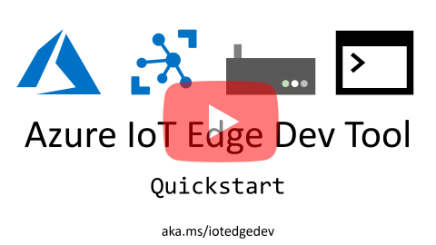

# Azure IoT Edge Dev Tool

The **Azure IoT Edge Dev Tool** greatly simplifies [Azure IoT Edge](https:/azure.microsoft.com/en-us/services/iot-edge/) development down to simple commands driven by Environment Variables. 

 - It gets you started with IoT Edge development with the [IoT Edge Dev Container](#iot-edge-dev-container) and IoT Edge Solution Scaffolding that contains a sample module and all the required configuration files.
 - It speeds up your inner-loop dev (dev, debug, test) by reducing multi-step build & deploy processes into one-line CLI commands and well as drive your outer-loop CI/CD pipeline. _You can use all the same commands in both stages of your development life-cycle._

## Overview
For the absolute fastest way to get started with IoT Edge Dev, please see the [Quickstart](#quickstart) section below.

For a more detailed overview of IoT Edge Dev Tool including setup and commands, please see the [Wiki](https://github.com/Azure/iotedgedev/wiki).

## Quickstart
This quickstart will run a container, create a solution, setup Azure resources, build and deploy modules to your device, setup and start the Edge Runtime and then monitor messages flowing into IoT Hub.

Here's a 3 minute video walk-through of this Quickstart:

[](https://aka.ms/iotedgedevquickstart)

The only thing you need to install is Docker. All of the other dev dependencies are included in the container. 

1. **Install [Docker](https://docs.docker.com/engine/installation/)**

    - Open Docker Settings and setup a Shared Drive that you'll use to store your IoT Edge Solution files.

1. **Run the Azure IoT Edge Dev Container**

    Before you run the container, you will need to create a local folder to store your IoT Edge solution files.
    
    **Windows**
    ```
    mkdir c:\temp\iotedge
    docker run -ti -v /var/run/docker.sock:/var/run/docker.sock -v c:/temp/iotedge:/home/iotedge microsoft/iotedgedev
    ```

    **Linux**
    ```
    sudo mkdir /home/iotedge
    docker run -ti -v /var/run/docker.sock:/var/run/docker.sock -v /home/iotedge:/home/iotedge microsoft/iotedgedev
    ```

1. **Initialize Edge Solution and Setup Azure Resources**

    `iotedgedev init`

    > 'iotedgedev init' will run both 'iotedgedev solution .' and 'iotedgedev azure', which will create a solution and setup your Azure resource in a single comamnd.

1. **Build & Push IoT Edge Modules**

    `iotedgedev push`

    > You can also combine build, push and deploy with `iotedgedev push --deploy`

1. **Deploy Modules to IoT Edge Device**

    `iotedgedev deploy`
    
1. **Start the IoT Edge Runtime**

    `iotedgedev start`

1. **Monitor Messages sent from IoT Edge to IoT Hub**

    `iotedgedev monitor`

## Resources
Please refer to the [Wiki](https://github.com/Azure/iotedgedev/wiki) for details on setup, usage, and troubleshooting.

Please refer to the [Contributing file](CONTRIBUTING.md) for details on contributing changes.