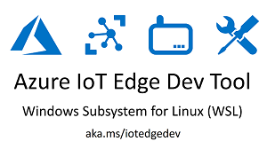

# Azure IoT Edge Dev Tool

The Azure IoT Edge Dev Tool **greatly simplifies** your Azure IoT Edge development process. It has everything you need to get started and helps with your day-to-day IoT Edge development.

You will be able to do all of the following with simple one line commands.

1. Install the Azure IoT Edge Dev Tool: `pip install azure-iot-edge-dev-tool`
1. Create a new Edge project: `iotedgedev project --create`
1. Build, Push and Deploy modules: `iotedgedev modules --build --deploy`
1. Setup and Start the Edge Runtime: `iotedgedev runtime --setup --start`
1. View and Save Docker log files: `iotedgedev docker --logs`
1. Use a Custom Container Registry: `iotedgedev docker --setup-registry`

The project was created by Microsofties that work with IoT Edge customers, who have found it very helpful.  We hope to get a variation of this officially supported by the Azure IoT team in the near future. Your contributions and feedback to this project will help us build an amazing developer experience, so please do not hesitate to participate.

Please see [Azure IoT Edge Dev Resources](https://github.com/jonbgallant/azure-iot-edge-dev) for links to official docs and other IoT Edge dev information.

## Videos
[](https://www.youtube.com/watch?v=NsnxMshMhmA)

https://www.youtube.com/watch?v=NsnxMshMhmA

[](https://www.youtube.com/watch?v=k5ZtTmHgs_8)

https://www.youtube.com/watch?v=k5ZtTmHgs_8

[](https://www.youtube.com/watch?v=lcDFX8PXqUQ)

https://www.youtube.com/watch?v=lcDFX8PXqUQ

## Setup
### Azure Setup
1. [Create Azure IoT Hub](https://docs.microsoft.com/en-us/azure/iot-hub/iot-hub-csharp-csharp-getstarted#create-an-iot-hub)
1. [Create Azure Container Registry](https://docs.microsoft.com/en-us/azure/container-registry/container-registry-get-started-portal)
    - Make sure you enable Admin Access when you create the Azure Container Registry
1. Create Edge Device using the Azure Portal
    - In your IoT Hub, click "IoT Edge", then click "Add IoT Edge Device"

You can also deploy the IoT Hub and Container Registry with this **Deploy to Azure** template:

[](https://portal.azure.com/#create/Microsoft.Template/uri/https%3A%2F%2Fraw.githubusercontent.com%2Fjonbgallant%2Fazure-iot-edge-dev-tool%2Fmaster%2Fassets%2Fdeploy%2FARMDeployment%2Fazuredeploy.json)

### Dev Machine Setup

Here's what you need to do to get `iotedgedev` running on your dev machine. If you are using a separate Edge device, like a Raspberry Pi, you do not need to run all of these steps on your Edge device, you can just use `iotedgectl` directly .  See the [Edge Device Setup](#edge-device-setup) section below for more information on setting up your Edge device.

> Note: See the ["Test Coverage"](#test-coverage) section below to see what this module has been tested with.

1. Install **[Docker](https://docs.docker.com/engine/installation/)**
    - Windows    
        - Switch to Linux Containers if you are running Windows.

    - Windows Subsystem for Linux (WSL)

        > Here's a video that shows you how to setup WSL: https://www.youtube.com/watch?v=k5ZtTmHgs_8

        1. **Do not** install Docker in WSL, you can use Docker on your Windows machine by modifying the path.
        1. In Docker Settings/General, Check "Expose Daemon on tcp:// without TLS"
        1. Execute the following in a Bash terminal. This will make `docker` available in your Bash terminal.
            
            ```
            echo "PATH=\"$PATH:$HOME/bin:$HOME/.local/bin:/mnt/c/Program\ Files/Docker/Docker/resources/bin\"" >> ~/.bashrc
            echo "alias docker=docker.exe" >> ~/.bashrc
            echo "alias docker-machine=docker-machine.exe" >> ~/.bashrc
            echo "alias docker-compose=docker-compose.exe" >> ~/.bashrc
            echo "export DOCKER_HOST='tcp://localhost:2375'" >> ~/.bashrc
            source ~/.bashrc

            sudo sh -c "echo Defaults  env_keep += \"DOCKER_HOST\" >> /etc/sudoers.d/docker"
            ```
    - Linux
        1. **Do not** install via `sudo apt install docker.io`. Use the proper steps for [CE here](https://docs.docker.com/engine/installation/linux/docker-ce/ubuntu/#install-docker-ce), or use the [convenience script](https://docs.docker.com/engine/installation/linux/docker-ce/ubuntu/#install-using-the-convenience-script).
    
    

1. Install **Python 2.7 or Python 3**
    - Windows - [Install from Python's website, use Win64 installer](https://www.python.org/downloads/)
    - Linux - `sudo apt install python-pip` or `sudo apt install python3-pip`
    
1. Install **[.NET Core SDK](https://www.microsoft.com/net/core#windowscmd)**
    - The .NET Core SDK does not run on ARM, so you do not need to install this on Raspberry Pi.

1. Install **Dependencies**

    > You can also run under a Python Virtual Environment.  See the [Python Virtual Environment Setup](#python-virtual-environment-setup) instructions below for details on how to set that up.

    1. System Dependencies
        1. Mac:
            ```
            sudo easy_install pip
            brew install libffi
            ```

        1. Raspberry Pi:
            ```
            sudo pip install --upgrade setuptools pip
            sudo apt install python2.7-dev libffi-dev libssl-dev -y
            ```
1. Install **`azure-iot-edge-dev-tool`**

    > You do not need to run this on the Raspberry Pi Edge device. See the [Edge Device Setup](#edge-device-setup) section below for more information on setting up your Edge device.

    1. Via Pip - Use this if you want to use the tool as is.
        ```
        pip install azure-iot-edge-dev-tool
        ```  

    1. Via GitHub - Use this if you want to make changes to this tool.

        1. Clone or Fork this Repository

            > Replace `project-name` with the name of your project.

            `git clone https://github.com/jonbgallant/azure-iot-edge-dev-tool.git project-name`

        1. Install Dependencies

            > Use 'sudo' for Mac/Linux/RaspberryPi. 
            
            `pip install -U -r requirements.txt`

        1. Install iotedgedev Module

            The following command will make `iotedgedev` available in your terminal.

            From the root of repo:

            `pip install -e .`

## Usage

Here's how you create a project, build and deploy our modules, and then setup and start the Edge runtime. 

### Step 1: Create Azure IoT Edge Project

The following command will setup the folder structure required for this module

> Replace `edge-project` with the name of your project.  Use `.` to create in the current folder.

```
iotedgedev project --create edge-project
```

#### Folder Structure

When you create a new project, it will have the following contents:

1. **config folder** - Contains sample config files for both modules and runtime.

1. **build folder** - Contains the files outputted by the .NET Core SDK.

1. **modules folders** - Contains all of the modules for your Edge project.
    - The iotedgedev module assumes that you'll structure your Dockerfiles exactly like the filter-module sample.  Have a Docker folder in the root of the project, then subfolders within that to support multiple Docker files.
        
    > It is important that you follow this structure or the module will not work.  Please make suggestions or fork this project if you would like a different behavior.

1. **logs folder** - Contains all the Docker log files for the Runtime and your modules.

1. **.env.tmp** - Contains all the required Environment Variables for Edge Project. Rename to .env and add your settings.

1. **.gitigore.tmp** - A suggested .gitignore file for your Edge projects. Rename to .gitignore if you'd like to use it.

### Step 2: Update Environment Variables

The settings used for this module are stored in a .env file in the root of your project. System or User Environment Variables take precedence over values in .env file.

1. Rename `.env.tmp` to `.env` or run the following command:

    `cp .env.tmp .env`

2. Open `.env` and set variables

    1. Runtime Home Directory

        - For Linux/Raspberry Pi, change: `RUNTIME_HOME_DIR="/etc/azure-iot-edge"`

    1. Active Modules

        - You can tell `iotedgedev` which modules you want to build by including them in the `ACTIVE_MODULES` setting.  Comma separated. 

    1. Active Docker Directories
    
        - You can tell `iotedgedev` which Docker files to build and push by including the Dockerfile's parent folder in the `ACTIVE_DOCKER_DIRS` setting.

    1. At a minimum, you need to set the following values, which you you can get from your Azure account:
        ```
        IOTHUB_NAME="iot hub name"
        IOTHUB_KEY="iot hub key" 
        DEVICE_CONNECTION_STRING="edge device connection string"
        EDGE_DEVICE_ID="edge device id" 
        RUNTIME_HOST_NAME="the computer name that your edge will run on"
        CONTAINER_REGISTRY_SERVER="" 
        CONTAINER_REGISTRY_USERNAME=""
        CONTAINER_REGISTRY_PASSWORD=""
        ```
1. Update Config

    If you are running on Raspberry Pi you need to use the arm32v7 Dockerfile. Open `config/modules.json`, find the `filter-module` line and replace `linux-x64` with `arm32v7`. 

    Replace this:
    `"image": "${CONTAINER_REGISTRY_SERVER}/filter-module:linux-x64-${CONTAINER_TAG}",`

    With this:
    `"image": "${CONTAINER_REGISTRY_SERVER}/filter-module:arm32v7-${CONTAINER_TAG}",`

### Step 3: Build and Deploy Modules

> Use `sudo` for Linux.  You __will not__ be able to build on the Raspberry Pi, because the .NET Core SDK does not support ARM. You can build on an x86 based machine and deploy to Pi.

```
iotedgedev modules --build --deploy
```

The- `--build` command will build each module in the `modules` folder and push it to your container registry.  The- `--deploy` command will apply the `build/modules.json` configuration file to your Edge device.

You can configure what modules will be built and deployed using the `ACTIVE_MODULES` env var in the `.env` file.

### Step 4: Setup and Start the Edge Runtime

> Use 'sudo' for Linux/RaspberryPi

```
iotedgedev runtime --setup --start
```

The- `--setup` command will apply the `/build/runtime.json` file to your Edge device.  The- `--start` command will start the Edge runtime.
   
### Step 5: Monitor Messages

#### Device Explorer

You can use the [Device Explorer](https://github.com/Azure/azure-iot-sdk-csharp/releases/download/2017-12-2/SetupDeviceExplorer.msi) to monitor the messages that are sent to your IoT Hub.

#### iothub-explorer

You can also use the [iothub-explorer](https://github.com/Azure/iothub-explorer) npm package:

```bash
npm i -g iothub-explorer
iothub-explorer --login "iothubowner connection string" monitor-events "your device id"
```

### Step 6: Create a new Module

After you have everything running from the Edge Tool project template, the next step is to develop all the custom modules you need for your scenario.  Here's how you do that:

1. Install the .NET Core Module Template

    This is the same template I used to create the filter-module.  It includes a sample C# project and Docker files.

    ```bash
    dotnet new -i Microsoft.Azure.IoT.Edge.Module
    ```

1. Create a new Module

    From the root of your project:

    ```bash
    dotnet new  aziotedgemodule -o modules/mymodule
    ```

    Now, when you run `iotedgedev modules --build` you will see that `mymodule` is also built and pushed to your container registry.

    > Without `iotedgedev` you would have had to do many more steps to get to this point.

1. Add Message Property

    We are going to add a new custom property to the message as it is flowing through the system so we can see that our module is working.

    1. Open `/modules/mymodule/Program.cs`.
    1. Add the following line right above the `SendEventAsync` call.

    ```csharp
    pipeMessage.Properties.Add("abc", "123");
    await deviceClient.SendEventAsync("output1", pipeMessage);
    ```
    
1. Add Module to Config

    1. Open `/config/modules.json`. 
    1. Copy and paste the filter-module section and change filter-module to mymodule.

    ```javascript
        "mymodule": {
            "version": "1.0",
            "type": "docker",
            "status": "running",
            "restartPolicy": "always",
            "settings": {
                "image": "${CONTAINER_REGISTRY_SERVER}/mymodule:linux-x64-${CONTAINER_TAG}",
                "createOptions": ""
            }
        }
    ```
    > Make sure you change it in two places, the name and the `settings.image` property.

1. Add Route to Config

    By default, your new module acts as a simple pass through. It receives messages and passes them to the output. We will add `mymodule` in between our existing `sensor` and `filter` modules. 

    1. Open `/config/modules.json`
    1. Replace `$edgeHub.properties.desired.routes` with the following:

    ```javascript
        "routes": {
          "sensorToMyModule": "FROM /messages/modules/temp-sensor-module/outputs/temperatureOutput INTO BrokeredEndpoint(\"/modules/mymodule/inputs/input1\")",
          "myModuleToFilter": "FROM /messages/modules/mymodule/outputs/output1 INTO BrokeredEndpoint(\"/modules/filter-module/inputs/input1\")",
          "filterToIoTHub": "FROM /messages/modules/filter-module/outputs/output1 INTO $upstream"
        },
    ```

1. Build and Deploy Modules

    Now that we have the module created, code added, and config updated, we are going to rebuild, deploy our module.

    > You will notice that the Edge Runtime automatically detects a new deployment, retrieves the new module, applies the new route and keeps sending messages.

    `iotedgedev modules --build --deploy`

1. Monitor Messages

    Now when we view the messages flowing through the system, we'll see an additional 'abc' property:

    Here's how with the [iothub-explorer](https://github.com/Azure/iothub-explorer) npm package:

    ```bash
        npm i -g iothub-explorer
        iothub-explorer --login "iothubowner connection string" monitor-events "your device id"
    ```

    ```javascript
        "machine": {
            "temperature": 102.97201423520322,
            "pressure": 10.338583900213024
        },
        "ambient": {
            "temperature": 20.577302686906094,
            "humidity": 26
        },
        "timeCreated": "2017-12-31T15:15:13.8580843Z"
        }
        ---- application properties ----
        {
            "abc": "123",
            "MessageType": "Alert"
        }
    ```

That's all there is to it.  You can now get started implementing your Edge scenario!

## Commands
The `iotedgedev` module has the following commands:

**project**

`iotedgedev project --help`
- `--create TEXT`  Creates a new Azure IoT Edge project. Use `--create .` to create in current folder. Use `--create TEXT` to create in a subfolder.

**runtime**

`iotedgedev runtime --help`
- `--setup`     Setup Edge Runtime using runtime.json in build/config directory.
- `--start`     Starts Edge Runtime. Calls iotedgectl start.
- `--stop`      Stops Edge Runtime. Calls iotedgectl stop.
- `--restart`   Restarts Edge Runtime. Calls iotedgectl stop, removes module containers and images, calls iotedgectl setup (with --config-file) and then calls iotedgectl start.
- `--status`    Edge Runtime Status. Calls iotedgectl status.

**modules**

`iotedgedev modules --help`
- `--build`     Builds and pushes modules specified in ACTIVE_MODULES Environment Variable to specified container registry.
- `--deploy`    Deploys modules to Edge device using modules.json in  build/config directory.

**docker**

`iotedgedev docker --help`
- `--setup-registry`     Pulls Edge Runtime from Docker Hub and pushes to your specified container registry. Also, updates config files to use CONTAINER_REGISTRY_* instead of the Microsoft Docker hub. See CONTAINER_REGISTRY  Environment Variables.
- `--clean`              Removes all the Docker containers and Images.
- `--remove-modules`     Removes only the edge modules Docker containers and images specified in ACTIVE_MODULES, not edgeAgent or edgeHub.
- `--remove-containers`  Removes all the Docker containers
- `--remove-images`      Removes all the Docker images.
- `--logs`               Opens a new terminal window for edgeAgent, edgeHub and each edge module and saves to LOGS_PATH. You can configure the terminal command with LOGS_CMD.
- `--show-logs`          Opens a new terminal window for edgeAgent, edgeHub and each edge module. You can configure the terminal command with LOGS_CMD.
- `--save-logs`          Saves edgeAgent, edgeHub and each edge module logs to LOGS_PATH.

**iotedgedev commands**

- `--version`     Show the version and exit.
- `--set-config`  Expands Environment Variables in /config/*.json and copies to  /build/config.

### Setup Container Registry

You can also use `iotedgedev` to host the Edge runtime from your own Azure Container Registry or a Local Container Registry.  Set the `.env` values for your Container Registry and run the following command. It will pull all the Edge containers from Dockerhub, tag them and upload them to the container registry you have specified in `.env`. 

> Use 'sudo' for Linux/RaspberryPi

```
iotedgedev docker --setup-registry
```


### View Docker Logs

#### Show Logs
The iotedgedev module also include a "Show Logs" command that will open a new command prompt for each module it finds in your Edge config.  Just run the following command:

> Note: I haven't figured out how to launch new SSH windows in a reliable way.  It's in the backlog.  For now, you must be on the desktop of the machine to run this command.

```
iotedgedev docker --show-logs
```

You can configure the logs command in the `.env` file with the `LOGS_CMD` setting.  The `.env.tmp` file provides two options, one for [ConEmu](https://conemu.github.io/) and one for Cmd.exe.

#### Save Logs

You can also output the logs to the LOGS_PATH directory.  The following command will output all the logs and add them to an `edge-logs.zip` file that you can send to the Azure IoT support team if they request it.

```
iotedgedev docker --save-logs
```

#### Both Show and Save Logs

Run the following to show and save logs with a single command

```
iotedgedev docker --logs
```


### Local Docker Registry Setup

Instead of using a cloud based container registry, you can use a local Docker registry.  Here's how to get it setup.

1. Set `CONTAINER_REGISTRY_SERVER` in .env to `localhost:5000`. You can enter a different port if you'd like to.
1. Add `localhost:5000` and `127.0.0.1:5000` to Docker -> Settings -> Daemon -> Insecure Registries

`iotedgedev` will look for `localhost` in your setting and take care of the rest for you.

## Edge Device Setup

The `iotedgedev` module is intended to help with Edge development and doesn't necessarily need to be taken on as a dependency in production or integration environments, where you'll likely want to use the `iotedgectl` module directly. You can use `iotedgedev` to generate your runtime.json file on your dev machine, copy that to your Edge device and then use the following command to setup and start your Edge Runtime. 

```
iotedgectl setup --config-file runtime.json
iotedgectl start
```

Having said that, there's nothing stopping you from deploying `iotedgedev` to your Edge device. It may be helpful if you want to run the `iotedgedev docker --clean` command to clean up Docker containers and images. Or if you want to run `iotedgedev docker --show-logs` to see all the log files on the device or `iotedgedev docker --save-logs` to output to the LOGS_PATH directory.

> Please note that the .NET Core SDK does not support ARM, so you will not be able to run `modules --build` or `modules --deploy` directly on a Raspberry Pi.

### Raspberry Pi

Whether you use `iotedgedev` or directly use `iotedgecgtl` on the Raspberry Pi, you will still need to run the following commands before you run the Edge Runtime.

    ```
    sudo pip install --upgrade setuptools pip
    sudo apt install python2.7-dev libffi-dev libssl-dev -y
    sudo pip install -U azure-iot-edge-dev-tool
    ```

## Python Virtual Environment Setup

You can run `iotedgedev` inside a Python Vritual Environment. 

1. Install virtualenv

    `pip install virtualenv`

1. Create virtualenv

    Execute the following from the root of this repository.

    `virtualenv venv`

    > venv is just a project name that can be anything you want, but we recommend sticking with venv because the .gitignore file excludes it.

1. Activate the virtualenv

    Windows: `venv\Scripts\activate.bat`

    Posix: `source venv/bin/activate`

1. Install Dependencies

    Continue with the instructions above starting with the [Dev Machine Setup](#dev-machine-setup) -> Install Dependencies.

1. Deactivate the virtualenv

    When you are done with your virtualenv, you can deactivate it with the follow command:

    `deactivate`

## Test Coverage

This module has been tested with the following:
- Windows 10 Fall Creators Update
- Windows Subsystem for Linux, Ubuntu 16.04
- Ubuntu 16.04
- Mac Sierra 10.12.6
- Raspberry Pi with Raspbian Stretch (**.NET Core Runtime Only**, .NET Core SDK not supported on ARM.) - You cannot use Raspberry Pi as a Edge dev machine, but it can host the Edge runtime.
- Python 2.7.13 and Python 3.6.3
- Docker Version 17.09.1-ce-win42 (14687), Channel: stable, 3176a6a

## Troubleshooting

1. Invalid Reference Format
    ```
    500 Server Error: Internal Server Error for url: http+docker://localunixsocket/v1.30/images
    500 Server Error: Internal Server Error ("invalid reference format")
    ```

    Solution: You likely installed Docker via `sudo apt install docker.io`. Use the proper steps for [CE here](https://docs.docker.com/engine/installation/linux/docker-ce/ubuntu/#install-docker-ce), or use the [convenience script](https://docs.docker.com/engine/installation/linux/docker-ce/ubuntu/#install-using-the-convenience-script).

1. Permissions Error

    ```
    The directory '/home/user/.cache/pip/http' or its parent directory is not owned by the current user and the cache has been disabled. Please check the permissions and owner of that directory. If executing pip with sudo, you may want sudo's -H flag.
    ```
    
    Solution: Run pip install with -H `sudo -H pip install -U -r requirements.txt`

1. Latest Docker Image Not Pulled from Registry

    By design, Docker only pulls images that have been changed.  When you are developing you tend to push new images on a frequent basis, which Docker will not pull unless it has a unique tag.  You could assign every push a new tag, or you can simply run the following command on the Edge device.

    ```
    iotedgedev runtime --restart
    ```

    This stops the runtime, removes your ACTIVE_MODULES containers and images, calls setup and then starts the runtime.  Docker will then be forced to pull the imageS from the registry because it does not have them locally anymore.

1. 404 Client Error: Not Found ("No such container: edgeAgent")

    I occasionally see this when running `iotedgedev runtime --restart`, but I have never seen it cause any issues.  LMK if you see any issues because of it.

1. ('Connection aborted.', error(2, 'No such file or directory'))

    This means that you have likely do not have DOCKER\_HOST Environment Variable set.  If you are running WSL, then please see the Dev Machine Setup steps above. You have to write DOCKER_HOST to your ~/.bashrc file.

    ```
    ERROR: Could not login to Container Registry. Please verify your credentials in CONTAINER_REGISTRY_ environment variables. 
    If you are using WSL, then please set DOCKER_HOST Environment Variable. See the projects readme for full instructions.
    ```

    ```
    ('Connection aborted.', error(2, 'No such file or directory'))
    ERROR: Could not connect to docker daemon.
    ERROR: Docker is unavailable
    CRITICAL: IoT Edge dependency not available: docker
    ```

## Backlog

Please see the [GitHub project page](https://github.com/jonbgallant/azure-iot-edge-dev-tool/projects) for backlog tasks.

## Issues

Please use the [GitHub issues page](https://github.com/jonbgallant/azure-iot-edge-dev-tool/issues) to report any issues.

## Contributing

Please fork, branch and pull-request any changes you'd like to make.

#### Contributor dev setup
1. Install **[Microsoft Visual C++ 14.0](http://landinghub.visualstudio.com/visual-cpp-build-tools)**

1. Install **OpenSSL**
    - Windows - [Install from OpenSSL's website](https://www.openssl.org/source/)
        > after download, Save it in>C:\OpenSSL-Win64\ 

1. Make sure both **Python 2.7 and Python 3** are installed

1. Install dependencies
    Run the following command to install all the dependencies needed to build iotedgedev and run the tests.
    
    `pip install -r requirements_dev.txt`
    
#### Run the tests 
    Run the following command to run tests.

    `tox`

