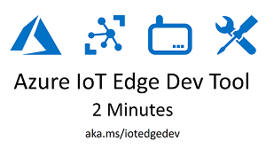

# Azure IoT Edge Dev Tool

The **Azure IoT Edge Dev Tool** greatly simplifies [Azure IoT Edge](https://azure.microsoft.com/en-us/services/iot-edge/) development down to simple CLI commands driven by Environment Variables. 

 - It gets you started with IoT Edge development with the [IoT Edge Dev Container](#dev-machine-setup) and IoT Edge Solution Scaffolding that contains a sample module and all the required configuration files.
 - It speeds up your inner-loop dev (dev, debug, test) by reducing multi-step build & deploy processes into one-line CLI commands and well as drive your outer-loop CI/CD pipeline. _You can use all the same commands in both stages of your development life-cycle._
 
## Quickstart
Here is the absolute fastest way to get started with IoT Edge Dev. This quickstart will run a container, create a solution, setup Azure resources, build and deploy modules to your device, setup and start the Edge Runtime and then monitor messages flowing into IoT Hub.

The only thing you need to install is Docker. All of the other dev dependencies are included in the container. 

1. Install **[Docker](https://docs.docker.com/engine/installation/)**

1. Run the Azure IoT Edge Dev Container

    **Windows**
    ```
    docker run -ti -v /var/run/docker.sock:/var/run/docker.sock c:/temp/iotedge:/home/iotedge jongallant/iotedgedev
    ```

    **Linux**
    ```
    docker run -ti -v /var/run/docker.sock:/var/run/docker.sock /home/iotedge:/home/iotedge jongallant/iotedgedev
    ```

1. Initialize Edge Solution and Setup Azure Resources

    `iotedgedev init`

1. Build & Push IoT Edge Modules

    `iotedgedev push`

    > You can also combine build, push and deploy with `iotedgedev push --deploy`

1. Deploy Modules to IoT Edge Device

    `iotedgedev deploy`
    
1. Start the IoT Edge Runtime

    `iotedgedev start`

1. Monitor Messages sent from IoT Edge to IoT Hub

    `iotedgedev monitor`

## Overview
The **Azure IoT Edge Dev Tool** enables you to do all of the following with simple one-line CLI commands.

1. **Start Container**: Install the Azure IoT Edge Dev Tool:

    `docker run -it -v /var/run/docker.sock:/var/run/docker.sock -v c:/temp/iotedge:/home/iotedge jongallant/iotedgedev`

    This container includes all of the dependencies you need for IoT Edge development, including:

    - Docker
    - .NET Core SDK
    - Python
    - Pip
    - Azure CLI

    You can also directly install the tool with: `pip install azure-iot-edge-dev-tool`   
    
1. **Create Solution**: Create a new IoT Edge Solution that includes a sample module and all the the required configuration files.

    `iotedgedev solution edgesolution1`

    `cd edgesolution1`

1. **Setup Azure**: Creates or selects your Azure IoT Hub and Edge Device and updates your Environment Variables.

    `iotedgedev azure`

    > This must be run from the root of your solution, so make sure you cd into the `edgesolution1` folder before you run this command.

1. **Build, Push & Deploy**: Build, Push and Deploy modules: 

    `iotedgedev push --deploy`
    
    > This will `dotnet build`, `publish`, `docker build, tag and push` and `deploy modules` to your IoT Edge device.

    If your module is not dotnet, then the dotnet build/publish steps will be skipped.
    
1. **Setup & Start**: Setup and Start the IoT Edge Runtime: 

    `iotedgedev start`

1. **View Messages**: View Messages Sent from IoT Edge to IoT Hub: 

    `iotedgedev monitor`

1. **View Logs**: View and Save Docker log files: 

    `iotedgedev docker --logs`

1. **Setup Custom Registry**: Use a Custom Container Registry: 

    `iotedgedev docker --setup-registry`

Please see [Azure IoT Edge Dev Resources](https://github.com/jonbgallant/azure-iot-edge-dev) for links to official docs and other IoT Edge dev information.

## Videos

[Azure IoT Edge Dev Tool in 2 Minutes](https://www.youtube.com/watch?v=NsnxMshMhmA)
[](https://www.youtube.com/watch?v=NsnxMshMhmA)

[Azure IoT Edge Dev Tool: Introduction](https://www.youtube.com/watch?v=lcDFX8PXqUQ)
[](https://www.youtube.com/watch?v=lcDFX8PXqUQ)

[Azure IoT Edge Dev Tool with Windows Subsystem for Linux (WSL)](https://www.youtube.com/watch?v=k5ZtTmHgs_8)
[](https://www.youtube.com/watch?v=k5ZtTmHgs_8)


## Setup
### Azure Setup
#### Automated Setup

The following will show you how to setup your Azure Resources via the CLI instead of using the Portal.

First, create a solution with the following command:

`iotedgedev solution edgesolution1`

Then, cd into that solution:

`cd edgesolution`

Then, run the `iotedgedev azure` command to setup your Azure Resources. This command will bring you through a series of prompts to create Azure Resources and retrieve your IoT Hub and Edge Device connection strings and save them to the `.env` file in the root of the project. All subsequent commands will use those environment variables.

Here are all the `azure` command options:

> You can override all of these parameters with environment variables. Please see the .env file in your solution for details.

```
iotedgedev azure
    --credentials USERNAME PASSWORD
    --service-principal USERNAME PASSWORD TENANT
    --subscription THE_SUBSCRIPTION_ID 
    --resource-group-location THE_RG_LOCATION
    --resource-group-name THE_RG_NAME 
    --iothub-sku THE_IOT_SKU 
    --iothub-name THE_IOT_NAME 
    --edge-device-id THE_EDGE_DEVICE_NAME
    --update-dotenv
```

You can use the following `az cli` command to create a service principal:

```
az ad sp create-for-rbac -n "iotedgedev01"
```

> Note: Running `iotedgedev azure` without any other parameters will save you time from looking up the required parameter values. The command will help you choose the parameters in an interactive way.

Alternatively, you can deploy the IoT Hub **and** Container Registry with this **Deploy to Azure** template:

[](https://portal.azure.com/#create/Microsoft.Template/uri/https%3A%2F%2Fraw.githubusercontent.com%2Fjonbgallant%2Fazure-iot-edge-dev-tool%2Fmaster%2Fassets%2Fdeploy%2FARMDeployment%2Fazuredeploy.json)

> Note: If you do not need a Container Registry, or are planning to use a local registry, then you should run the **iotedgedev azure** command instead of running this **Deploy to Azure** template, because the template includes a Container Registry.

#### Manual Setup
1. [**Create Azure IoT Hub**](https://docs.microsoft.com/en-us/azure/iot-hub/iot-hub-csharp-csharp-getstarted#create-an-iot-hub)
1. **Create Edge Device** using the Azure Portal
    - In your IoT Hub, click "IoT Edge", then click "Add IoT Edge Device"

1.  **Container Registry**
    When you develop for IoT Edge, you need to host your images in a container registry, which the IoT Edge runtime will fetch the images from when it starts. 

    > By default, the IoT Edge Dev Tool, will use the Local Registry.

    We have tested the following options, but you can host your images on any Docker compatible registry host.

    1. Local Registry

        Set CONTAINER_REGISTRY_SERVER to localhost:5000 and leave CONTAINER_REGISTRY_USERNAME/CONTAINER_REGISTRY_PASSWORD blank.

        `CONTAINER_REGISTRY_SERVER="localhost:5000"`

    1. Azure Container Registry

        You can create an [**Azure Container Registry**](https://docs.microsoft.com/en-us/azure/container-registry/container-registry-get-started-portal) and host your images there.
            - Make sure you enable Admin Access when you create the Azure Container Registry

        After created, open .env and set the following:

        ```
        CONTAINER_REGISTRY_SERVER="ACR URI" 
        CONTAINER_REGISTRY_USERNAME="ACR USERNAME"
        CONTAINER_REGISTRY_PASSWORD="ACR PASSWORD"
        ```

        Example:
        ```
        CONTAINER_REGISTRY_SERVER="jong.azurecr.io" 
        CONTAINER_REGISTRY_USERNAME="jong"
        CONTAINER_REGISTRY_PASSWORD="p@$$w0rd"
        ```

    1. Docker Hub

        You can also host your images on Docker Hub. Create a Docker Hub account and then open .env and enter the following:

        ```
        CONTAINER_REGISTRY_SERVER="DOCKER HUB USERNAME" 
        CONTAINER_REGISTRY_USERNAME="DOCKER HUB USERNAME"
        CONTAINER_REGISTRY_PASSWORD="DOCKER HUB PASSWORD"
        ```

        Example:

        ```
        CONTAINER_REGISTRY_SERVER="jongallant" 
        CONTAINER_REGISTRY_USERNAME="jongallant"
        CONTAINER_REGISTRY_PASSWORD="p@$$w0rd"
        ```

### Dev Machine Setup

Here's what you need to do to get Azure IoT Edge Dev Tool (aka `iotedgedev`) running on your dev machine. If you are using a separate Edge device, like a Raspberry Pi, you do not need to run all of these steps on your IoT Edge device, you can just use `iotedgectl` directly on the device. See the [IoT Edge Device Setup](#iot-edge-device-setup) section below for more information on setting up your Edge device.

> Note: See the ["Test Coverage"](#test-coverage) section below to see what the Edge Dev Tool has been tested with.

#### IoT Edge Dev Tool Container
You can use the IoT Edge Dev Tool container to avoid having to install all the dependencies on your local dev machine.  

> (Only runs on Linux Containers at this time. Windows Container support coming soon.)

1. Install **[Docker](https://docs.docker.com/engine/installation/)**

1. Create Local Folder on Host Dev Machine that will contain your IoT Edge Solutions.

    `c:/temp/iotedge`

    > This allows you to use VS Code on your host machine and run all the `iotedgedev` commands in your container. We'll mount this folder to the container in the next step.

1. Start Container:

    `docker run -it -v /var/run/docker.sock:/var/run/docker.sock -v c:/temp/iotedge:/home/iotedge jongallant/iotedgedev`

1. Change to the `/iotedge` directory:

    `cd /iotedge`

1. Skip all the install steps below and jump to the [Usage](#usage) section below.

#### Local Dev Machine Setup

> You don't need to do this if you are running the container as described in the previous step.

1. Install **[Docker](https://docs.docker.com/engine/installation/)**
    - Windows    
        - Switch to Linux Containers if you are running Windows.

    - Windows Subsystem for Linux (WSL)

        > Here's a video that shows you how to setup WSL: https://www.youtube.com/watch?v=k5ZtTmHgs_8

        1. **Do not** install Docker in WSL, you can use Docker on your Windows machine by modifying the path.
        1. In Docker Settings/General, Check "Expose Daemon on tcp:// without TLS"
        1. Execute the following in a Bash terminal. This will make `docker` available in your Bash terminal.
            
            ```
            echo "PATH=\"$PATH:$HOME/bin:$HOME/.local/bin:/mnt/c/Program\ Files/Docker/Docker/resources/bin\"" >> ~/.bashrc
            echo "alias docker=docker.exe" >> ~/.bashrc
            echo "alias docker-machine=docker-machine.exe" >> ~/.bashrc
            echo "alias docker-compose=docker-compose.exe" >> ~/.bashrc
            echo "export DOCKER_HOST='tcp://localhost:2375'" >> ~/.bashrc
            source ~/.bashrc

            sudo sh -c "echo Defaults  env_keep += \"DOCKER_HOST\" >> /etc/sudoers.d/docker"
            ```
    - Linux
        - We've seen some issues with docker.io. If Edge doesn't run for you, then try installing Docker CE directly instead of via docker.io. Use the [CE install steps](https://docs.docker.com/engine/installation/linux/docker-ce/ubuntu/#install-docker-ce), or use the [convenience script](https://docs.docker.com/engine/installation/linux/docker-ce/ubuntu/#install-using-the-convenience-script).
        
1. Install **Python 2.7+ or Python 3.6+**
    - Windows - [Install from Python's website](https://www.python.org/downloads/)
    - Linux - `sudo apt install python-pip` or `sudo apt install python3-pip`
    
1. Install **[.NET Core SDK](https://www.microsoft.com/net/core#windowscmd)**
    - The .NET Core SDK does not run on ARM, so you do not need to install this on Raspberry Pi.

1. Install [Azure CLI 2.0](https://docs.microsoft.com/en-us/cli/azure/install-azure-cli?view=azure-cli-latest)

1. Install [Azure CLI IoT Extension](https://github.com/Azure/azure-iot-cli-extension/)

    `az extension add --name azure-cli-iot-ext`

1. Install **System Dependencies**

    > You can also run under a Python Virtual Environment.  See the [Python Virtual Environment Setup](#python-virtual-environment-setup) instructions below for details on how to set that up.

    1. System Dependencies
        1. Mac:
            ```
            sudo easy_install pip
            brew install libffi
            ```

        1. Raspberry Pi:
            ```
            sudo pip install --upgrade setuptools pip
            sudo apt install python2.7-dev libffi-dev libssl-dev -y
            ```
1. Install **IoTHub-Explorer**

    Currently, the only way to view IoT Hub Messages via CLI is with the `iothub-explorer` npm package.  You need to [install Node.js](https://nodejs.org/en/download/) and then install the `iothub-explorer` package with the following command:

    ```
    npm i -g iothub-explorer
    ```

    You can also use [Device Explorer](https://github.com/Azure/azure-iot-sdk-csharp/releases) as well, but it is Windows only.  The Azure IoT team is working on porting the monitor-events functionality to the official az iot CLI - but for now we'll use the npm package.

1. Install **`azure-iot-edge-dev-tool`**

    > You do not need to run this on the IoT Edge device. See the [IoT Edge Device Setup](#iot-edge-device-setup) section below for more information on setting up your IoT Edge device.

    ```
    pip install azure-iot-edge-dev-tool
    ```  

## Usage

Here's how you create a solution, build and deploy modules, and then setup and start the Edge runtime. 

### Step 1: Create Azure IoT Edge Solution

The following command will setup the folder structure required for this module

> Replace `edgesolution1` with the name of your solution.  Use `.` to create in the current folder.

```
iotedgedev solution edgesolution1
cd edgesolution1
```

#### Folder Structure

When you create a new solution, it will have the following contents:

1. **modules folders** - Contains all of the modules for your IoT Edge Solution.
    - The iotedgedev module assumes that you'll structure your Dockerfiles exactly like the filtermodule sample.  Have a Docker folder in the root of the solution, then subfolders within that to support multiple Docker files.
        
    > It is important that you follow this structure or the module will not work.  Please make suggestions or fork this solution if you would like a different behavior.

1. **.env** - Contains all the required Environment Variables for your IoT Edge Solution.

1. **.gitignore** - A .gitignore file for your IoT Edge Solution.

1. **Configuration File Templates** - There are two files in the root of the solution:

    - `deployment.template.json` - Contains the config that is deployed to your IoT Edge device. It contains references to your modules, module routes and desired property information.
    - `runtime.template.json` - Contains the config used by your IoT Edge runtime.  It contains your device connection string, your container registry settings and is used when you call the `iotedgedev setup` or `iotedgedev start` commands.

1. **config folder** - All expanded config files are copied to this folder and these files are used at runtime.

1. **logs folder** - Contains all the Docker log files for the Runtime and your modules.

### Step 2: Update Environment Variables

The settings used for this module are stored in a .env file in the root of your solution. System or User Environment Variables take precedence over values in .env file.

1. Open `.env` and set variables

    You only need to set the `IOTHUB_CONNECTION_STRING` AND `DEVICE_CONNNECTION_STRING` settings, which you can get from the Azure Portal.

    ```
    IOTHUB_CONNECTION_STRING=""
    DEVICE_CONNECTION_STRING=""
    ```

    > You can use the `DOTENV_FILE` Environment Variable to point to a different .env file, such as .env.integration or .env.test. This is helpful in CI/CD pipeline scenarios where you'll want to target different environments and devices to ensure all scenarios are tested.

    This tool offers a wizard-like command to guide you through setting up Azure and also setting up the Environment Variables properly.

    ```
    iotedgedev azure
    ```

### Step 3: Build and Deploy Modules

> Use `sudo` for Linux.  You __will not__ be able to build on the Raspberry Pi, because the .NET Core SDK does not support ARM. You can build on an x86 based machine and deploy to Pi.

```
iotedgedev build --deploy
```

The- `build` command will build each module in the `modules` folder and push it to your container registry.  The- `--deploy` command will apply the generated `config/deployment.json` configuration file to your IoT Edge device.  You could also call `deploy` directly with `iotedgedev deploy`.

You can configure what modules will be built and deployed by using the `ACTIVE_MODULES` env var in the `.env` file. You can configure which Dockerfiles get built and deployed by using the `ACTIVE_DOCKER_DIRS` env var.

### Step 4: Setup and Start the IoT Edge Runtime

> Use 'sudo' for Linux/RaspberryPi

```
iotedgedev start
```

The `start` command will apply the `/config/runtime.json` file to your IoT Edge device and will start the IoT Edge runtime. You can also call `iotedgedev setup` and `iotedgedev start` independently.
   
### Step 5: Monitor Messages

```
iotedgedev monitor
```

This will print messages sent from the device specified in DEVICE_CONNECTION_STRING. To use this command, you first need to install the [iothub-explorer](https://github.com/Azure/iothub-explorer) npm package with the following command:

```bash
npm i -g iothub-explorer
```

> NOTE: iothub-explorer is included in the [IoT Edge Dev Tool Container](#iot-edge-dev-tool-container)

### Step 6: Create a new Module

After you have everything running from the IoT Edge Tool solution template, the next step is to develop all the custom modules you need for your scenario.  Here's how you do that:

> Note that as of 2/9, the public version of this module template is not yet aligned with the Edge Dev Tool. At this point you are better off creating a copy of the `filtermodule` module and renaming it to mymodule.  The dotnet module template will be updated soon.

1. Install the .NET Core Module Template

    This is the same template I used to create the filtermodule.  It includes a sample C# module project and Docker files.

    ```bash
    dotnet new -i Microsoft.Azure.IoT.Edge.Module
    ```

1. Create a new Module

    From the root of your solution:

    ```bash
    dotnet new  aziotedgemodule -o modules/mymodule
    ```

    Now, when you run `iotedgedev build` you will see that `mymodule` is also built and pushed to your container registry.

1. Add Message Property

    We are going to add a new custom property to the message as it is flowing through the system so we can see that our module is working.

    1. Open `/modules/mymodule/Program.cs`.
    1. Add the following line right above the `SendEventAsync` call.

    ```csharp
    pipeMessage.Properties.Add("abc", "123");
    await deviceClient.SendEventAsync("output1", pipeMessage);
    ```
    
1. Add Module to Config

    1. Open `deployment.template.json`. 
    1. Copy and paste the filtermodule section and change filtermodule to mymodule.

    ```javascript
        "mymodule": {
            "version": "1.0",
            "type": "docker",
            "status": "running",
            "restartPolicy": "always",
            "settings": {
                "image": "${CONTAINER_REGISTRY_SERVER}/mymodule:0.0.1-amd64",
                "createOptions": ""
            }
        }
    ```
    > Make sure you change it in two places, the name and the `settings.image` property.

1. Add Route to Config

    By default, your new module acts as a simple pass through. It receives messages and passes them to the output. We will add `mymodule` in between our existing `sensor` and `filter` modules. 

    1. Open `deployment.template.json`
    1. Replace `$edgeHub.properties.desired.routes` with the following:

    ```javascript
        "routes": {
          "sensorToMyModule": "FROM /messages/modules/temp-sensor-module/outputs/temperatureOutput INTO BrokeredEndpoint(\"/modules/mymodule/inputs/input1\")",
          "myModuleToFilter": "FROM /messages/modules/mymodule/outputs/output1 INTO BrokeredEndpoint(\"/modules/filtermodule/inputs/input1\")",
          "filterToIoTHub": "FROM /messages/modules/filtermodule/outputs/output1 INTO $upstream"
        },
    ```

1. Build and Deploy Modules

    Now that we have the module created, code added, and config updated, we are going to rebuild, deploy our module.

    > You will notice that the IoT Edge Runtime automatically detects a new deployment, retrieves the new module, applies the new route and keeps sending messages.

    `iotedgedev build --deploy`

1. Monitor Messages

    Now when we view the messages flowing through the system, we'll see an additional 'abc' property:

    ```bash
    iotedgedev monitor
    ```

    ```javascript
        "machine": {
            "temperature": 102.97201423520322,
            "pressure": 10.338583900213024
        },
        "ambient": {
            "temperature": 20.577302686906094,
            "humidity": 26
        },
        "timeCreated": "2017-12-31T15:15:13.8580843Z"
        }
        ---- application properties ----
        {
            "abc": "123",
            "MessageType": "Alert"
        }
    ```

That's all there is to it.  You can now get started implementing your IoT Edge scenario!

## Commands
**iotedgedev**
```
Usage: iotedgedev [OPTIONS] COMMAND [ARGS]...

Options:
  --version     Show the version and exit.
  --set-config  Expands environment variables in *.template.json and copies to config folder.
  -h, --help    Show this message and exit.

Commands:
  azure     Manage Azure Resources
  build     Builds All Active Modules
  deploy    Deploys Solution to IoT Edge Device
  docker    Docker Utilities
  e2e       Push, Deploy, Start, Monitor
  init      Creates Solution and Azure Resources
  iothub    Monitor IoT Hub Events
  modules   Build and Deploy IoT Edge Modules
  monitor   Monitors Messages from IoT Edge to IoT Hub
  push      Pushes Active Modules to Container Registry
  restart   Restarts IoT Edge Runtime
  runtime   Manage IoT Edge Runtime
  solution  Manage IoT Edge Solutions
  start     Starts IoT Edge Runtime
  stop      Stops IoT Edge Runtime
```
**iotedgedev azure**
```
Usage: iotedgedev azure [OPTIONS]

  Manage Azure Resources

Options:
  --setup                         Retrieves or creates the required Azure Resources.
  --credentials <TEXT TEXT>...    Enter Azure Credentials (username password).
  --service-principal <TEXT TEXT TEXT>...
                                  Enter Azure Service Principal Credentials (username password tenant).
  --subscription TEXT             The Azure Subscription Name or Id.  [required]
  --resource-group-location [australiaeast|australiasoutheast|brazilsouth|canadacentral|canadaeast|centralindia|centralus|eastasia|eastus|eastus2|japanwest|japaneast|northeurope|northcentralus|southindia|uksouth|ukwest|westus|westeurope|southcentralus|westcentralus|westus2]
                                  The Resource Group Location.  [required]
  --resource-group-name TEXT      The Resource Group Name (Creates a new Resource Group if not found).  [required]
  --iothub-sku [F1|S1|S2|S3]      The IoT Hub SKU.  [required]
  --iothub-name TEXT              The IoT Hub Name (Creates a new IoT Hub if not found).  [required]
  --edge-device-id TEXT           The IoT Edge Device Id (Creates a new Edge Device if not found).  [required]
  --update-dotenv                 If True, the current .env will be updated with the IoT Hub and Device connection
                                  strings.  [required]
  -h, --help                      Show this message and exit.
```
**iotedgedev build**
```
Usage: iotedgedev build [OPTIONS]

  Builds All Active Modules

Options:
  --push      Pushes modules to container registry.
  --deploy    Deploys modules to Edge device using deployment.json in the config folder.
  -h, --help  Show this message and exit.
```
**iotedgedev deploy**
```
Usage: iotedgedev deploy [OPTIONS]

  Deploys Solution to IoT Edge Device

Options:
  -h, --help  Show this message and exit.
```
**iotedgedev docker**
```
Usage: iotedgedev docker [OPTIONS]

  Docker Utilities

Options:
  --setup-registry     Pulls Edge Runtime from Docker Hub and pushes to your specified container registry. Also,
                       updates config files to use CONTAINER_REGISTRY_* instead of the Microsoft Docker hub. See
                       CONTAINER_REGISTRY environment variables.
  --clean              Removes all the Docker containers and Images.
  --remove-modules     Removes only the edge modules Docker containers and images specified in ACTIVE_MODULES, not
                       edgeAgent or edgeHub.
  --remove-containers  Removes all the Docker containers
  --remove-images      Removes all the Docker images.
  --logs               Opens a new terminal window for edgeAgent, edgeHub and each edge module and saves to LOGS_PATH.
                       You can configure the terminal command with LOGS_CMD.
  --show-logs          Opens a new terminal window for edgeAgent, edgeHub and each edge module. You can configure the
                       terminal command with LOGS_CMD.
  --save-logs          Saves edgeAgent, edgeHub and each edge module logs to LOGS_PATH.
  -h, --help           Show this message and exit.
```
**iotedgedev e2e**
```
Usage: iotedgedev e2e [OPTIONS]

  Push, Deploy, Start, Monitor

Options:
  -h, --help  Show this message and exit.
```
**iotedgedev init**
```
Usage: iotedgedev init [OPTIONS]

  Creates Solution and Azure Resources

Options:
  -h, --help  Show this message and exit.
```
**iotedgedev iothub**
```
Usage: iotedgedev iothub [OPTIONS]

  Monitor IoT Hub Events

Options:
  --monitor-events  Displays events that are sent from IoT Hub device to IoT Hub.
  --timeout TEXT    Number of milliseconds to monitor for events.
  -h, --help        Show this message and exit.
```
**iotedgedev modules**
```
Usage: iotedgedev modules [OPTIONS]

  Build and Deploy IoT Edge Modules

Options:
  --build     Builds modules specified in ACTIVE_MODULES Environment Variable.
  --push      Pushes modules specified in ACTIVE_MODULES Environment Variable to container registry.
  --no-build  Informs the push command to not build modules before pushing to container registry.
  --deploy    Deploys modules to Edge device using deployment.json in the config folder.
  -h, --help  Show this message and exit.
```
**iotedgedev monitor**
```
Usage: iotedgedev monitor [OPTIONS]

  Monitors Messages from IoT Edge to IoT Hub

Options:
  --timeout TEXT  Number of milliseconds to monitor for events.
  -h, --help      Show this message and exit.
```
**iotedgedev push**
```
Usage: iotedgedev push [OPTIONS]

  Pushes Active Modules to Container Registry

Options:
  --deploy    Deploys modules to Edge device using deployment.json in the config folder.
  --no-build  Informs the push command to not build modules before pushing to container registry.
  -h, --help  Show this message and exit.
```
**iotedgedev restart**
```
Usage: iotedgedev restart [OPTIONS]

  Restarts IoT Edge Runtime

Options:
  -h, --help  Show this message and exit.
```
**iotedgedev runtime**
```
Usage: iotedgedev runtime [OPTIONS]

  Manage IoT Edge Runtime

Options:
  --setup     Setup Edge Runtime using runtime.json in config folder.
  --start     Starts Edge Runtime. Calls iotedgectl start.
  --stop      Stops Edge Runtime. Calls iotedgectl stop.
  --restart   Restarts Edge Runtime. Calls iotedgectl stop, removes module containers and images, calls iotedgectl
              setup (with --config-file) and then calls iotedgectl start.
  --status    Edge Runtime Status. Calls iotedgectl status.
  -h, --help  Show this message and exit.
```
**iotedgedev solution**
```
Usage: iotedgedev solution [OPTIONS] [NAME]

  Manage IoT Edge Solutions

Options:
  --create TEXT  Creates a new Azure IoT Edge Solution. Use `--create .` to create in current folder. Use `--create
                 TEXT` to create in a subfolder.
  -h, --help     Show this message and exit.
```
**iotedgedev start**
```
Usage: iotedgedev start [OPTIONS]

  Starts IoT Edge Runtime

Options:
  -h, --help  Show this message and exit.
```
**iotedgedev stop**
```
Usage: iotedgedev stop [OPTIONS]

  Stops IoT Edge Runtime

Options:
  -h, --help  Show this message and exit.
```

### Setup Container Registry

You can also use `iotedgedev` to host the IoT Edge runtime from your own Azure Container Registry or a Local Container Registry.  Set the `.env` values for your Container Registry and run the following command. It will pull all the IoT Edge containers from Dockerhub, tag them and upload them to the container registry you have specified in `.env`. 

> Use 'sudo' for Linux/RaspberryPi

```
iotedgedev docker --setup-registry
```


### View Docker Logs

#### Show Logs
The iotedgedev module also include a "Show Logs" command that will open a new command prompt for each module it finds in your IoT Edge config.  Just run the following command:

> Note: I haven't figured out how to launch new SSH windows in a reliable way.  It's in the backlog.  For now, you must be on the desktop of the machine to run this command.

```
iotedgedev docker --show-logs
```

You can configure the logs command in the `.env` file with the `LOGS_CMD` setting.  The `.env` file provides two options, one for [ConEmu](https://conemu.github.io/) and one for Cmd.exe.

#### Save Logs

You can also output the logs to the LOGS_PATH directory.  The following command will output all the logs and add them to an `edge-logs.zip` file that you can send to the Azure IoT support team if they request it.

```
iotedgedev docker --save-logs
```

#### Both Show and Save Logs

Run the following to show and save logs with a single command

```
iotedgedev docker --logs
```


### Local Docker Registry Setup

Instead of using a cloud based container registry, you can use a local Docker registry.  Here's how to get it setup.

1. Set `CONTAINER_REGISTRY_SERVER` in .env to `localhost:5000`. You can enter a different port if you'd like to.
1. Add `localhost:5000` and `127.0.0.1:5000` to Docker -> Settings -> Daemon -> Insecure Registries

> In the latest `iotedgedev` build, step 2 above hasn't been required. But, if you run into issues, you may want to try adding those Insecure Registries.

`iotedgedev` will look for `localhost` in your setting and take care of the rest for you.

## IoT Edge Device Setup

The `iotedgedev` module is intended to help with IoT Edge development and doesn't necessarily need to be taken on as a dependency in production or integration environments, where you'll likely want to use the `iotedgectl` module directly. You can use `iotedgedev` to generate your runtime.json file on your dev machine, copy that to your IoT Edge device and then use the following command to setup and start your IoT Edge Runtime. 

```
iotedgectl setup --config-file runtime.json
iotedgectl start
```

Having said that, there's nothing stopping you from deploying `iotedgedev` to your IoT Edge device. It may be helpful if you want to run the `iotedgedev docker --clean` command to clean up Docker containers and images. Or if you want to run `iotedgedev docker --show-logs` to see all the log files on the device or `iotedgedev docker --save-logs` to output to the LOGS_PATH directory.

> Please note that the .NET Core SDK does not support ARM, so you will not be able to run `build` directly on a Raspberry Pi.

### Raspberry Pi

Whether you use `iotedgedev` or directly use `iotedgecgtl` on the Raspberry Pi, you will still need to run the following commands before you run the IoT Edge Runtime.

    ```
    sudo pip install --upgrade setuptools pip
    sudo apt install python2.7-dev libffi-dev libssl-dev -y
    sudo pip install -U azure-iot-edge-dev-tool
    ```

##### Config Changes
    If you are running on Raspberry Pi you need to use the arm32v7 Dockerfile. Open `deployment.template.json`, find the `filtermodule` line and replace `amd64` with `arm32v7`. 

    Replace this:
    `"image": "${CONTAINER_REGISTRY_SERVER}/filtermodule:0.0.1-amd64",`

    With this:
    `"image": "${CONTAINER_REGISTRY_SERVER}/filtermodule:0.0.1-arm32v7",`

##### Environment Variable Change

    Open your .env file and add arm32v7 to your ACTIVE_DOCKER_PLATFORMS setting. This will tell the IoT Edge Dev Tool to also build the arm32v7 images.

    `ACTIVE_DOCKER_PLATFORMS="amd64,arm32v7"`

## Python Virtual Environment Setup

You can run `iotedgedev` inside a Python Vritual Environment. 

1. Install virtualenv

    `pip install virtualenv`

1. Create virtualenv

    Execute the following from the root of this repository.

    `virtualenv venv`

    > venv is just a env name that can be anything you want, but we recommend sticking with venv because the .gitignore file excludes it.

1. Activate the virtualenv

    Windows: `venv\Scripts\activate.bat`

    Posix: `source venv/bin/activate`

1. Install Dependencies

    Continue with the instructions above starting with the [Dev Machine Setup](#dev-machine-setup) -> Install Dependencies.

1. Deactivate the virtualenv

    When you are done with your virtualenv, you can deactivate it with the follow command:

    `deactivate`

## Test Coverage

This module has been tested with the following:
- Windows 10 Fall Creators Update
- Windows Subsystem for Linux, Ubuntu 16.04
- Ubuntu 16.04
- Mac Sierra 10.12.6
- Raspberry Pi with Raspbian Stretch (**.NET Core Runtime Only**, .NET Core SDK not supported on ARM.) - You cannot use Raspberry Pi as a IoT Edge dev machine, but it can host the IoT Edge runtime.
- Python 2.7.13 and Python 3.6.3
- Docker Version 17.09.1-ce-win42 (14687), Channel: stable, 3176a6a

## Troubleshooting

1. Invalid Reference Format
    ```
    500 Server Error: Internal Server Error for url: http+docker://localunixsocket/v1.30/images
    500 Server Error: Internal Server Error ("invalid reference format")
    ```

    Solution: You likely installed Docker via `sudo apt install docker.io`. Use the proper steps for [CE here](https://docs.docker.com/engine/installation/linux/docker-ce/ubuntu/#install-docker-ce), or use the [convenience script](https://docs.docker.com/engine/installation/linux/docker-ce/ubuntu/#install-using-the-convenience-script).

1. Permissions Error

    ```
    The directory '/home/user/.cache/pip/http' or its parent directory is not owned by the current user and the cache has been disabled. Please check the permissions and owner of that directory. If executing pip with sudo, you may want sudo's -H flag.
    ```
    
    Solution: Run pip install with -H `sudo -H pip install -U -r requirements.txt` then `sudo -H pip install -U -r requirements_nodeps.txt --no-deps`

1. Latest Docker Image Not Pulled from Registry

    By design, Docker only pulls images that have been changed.  When you are developing you tend to push new images on a frequent basis, which Docker will not pull unless it has a unique tag.  You could assign every push a new tag, or you can simply run the following command on the IoT Edge device.

    ```
    iotedgedev runtime --restart
    ```

    This stops the runtime, removes your ACTIVE_MODULES containers and images, calls setup and then starts the runtime.  Docker will then be forced to pull the imageS from the registry because it does not have them locally anymore.

1. 404 Client Error: Not Found ("No such container: edgeAgent")

    I occasionally see this when running `iotedgedev runtime --restart`, but I have never seen it cause any issues.  LMK if you see any issues because of it.

1. ('Connection aborted.', error(2, 'No such file or directory'))

    This means that you have likely do not have DOCKER\_HOST Environment Variable set.  If you are running WSL, then please see the Dev Machine Setup steps above. You have to write DOCKER_HOST to your ~/.bashrc file.

    ```
    ERROR: Could not login to Container Registry. Please verify your credentials in CONTAINER_REGISTRY_ environment variables. 
    If you are using WSL, then please set DOCKER_HOST Environment Variable. See the [Edge Dev Tool readme](https://aka.ms/iotedgedev) for full instructions.
    ```

    ```
    ('Connection aborted.', error(2, 'No such file or directory'))
    ERROR: Could not connect to docker daemon.
    ERROR: Docker is unavailable
    CRITICAL: IoT Edge dependency not available: docker
    ```

## Backlog

Please see the [GitHub project page](https://github.com/jonbgallant/azure-iot-edge-dev-tool/projects) for backlog tasks.

## Issues

Please use the [GitHub issues page](https://github.com/jonbgallant/azure-iot-edge-dev-tool/issues) to report any issues.

## Contributing

Please fork, branch and pull-request any changes you'd like to make.

#### Contributor Dev Machine Setup

1. Clone or Fork this Repository

    `git clone https://github.com/jonbgallant/azure-iot-edge-dev-tool.git`

1. Rename `.env.tmp` in the root of the repo to `.env` and set the `IOTHUB_CONNECTION_STRING_` and `DEVICE_CONNECTION_STRING` values to settings from your IoT Hub and Edge Device. To set these values you could run `iotedgedev azure` in the root of the repo.

1. Install **[Microsoft Visual C++ Build Tools](http://landinghub.visualstudio.com/visual-cpp-build-tools)**

1. Run `npm install` from the root directory to install the required npm packages for iothub-explorer calls.

1. Install **OpenSSL 1.1.0g**
    - Windows
        1. [Download from OpenSSL's website](https://www.openssl.org/source/openssl-1.1.0g.tar.gz)
        1. Extract the downloaded .tar.gz to C:\OpenSSL\ 

1. Make sure both **Python 2.7 and Python 3.6** are installed

1. Install dependencies

    Run the following command to install all the dependencies needed to build iotedgedev and run the tests.

    ```
    pip install -r requirements_dev.txt
    ```

1. Editable Mode

    Run the following command from the root of the IoT Edge Dev Tool Solution to see changes to iotedgedev commands as you change code.

    ```
    pip install -e .
    ```

#### Run Tests

Run the following command to run tests.
    
    `tox`
    
    

